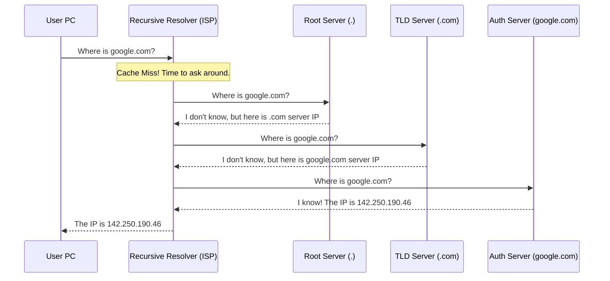
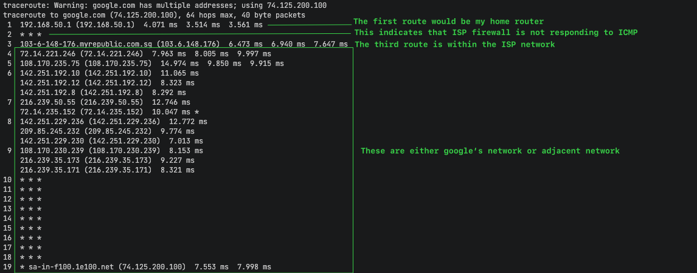

# 1. Understanding the Internet

The Internet is a global system of interconnected computer networks. It is the "network of networks" that allows devices worldwide to communicate.

## Physical Infrastructure
The internet isn't a cloud; it's tangible hardware connecting the world:
- **Undersea Cables**: Massive fiber-optic cables on the ocean floor carrying ~99% of intercontinental data.
- **Fiber Optic Cables**: The high-speed backbone of land-based networks connecting cities and countries.
- **Satellites & Wireless**: Providing connectivity to remote areas (e.g., ships, planes, rural locations).

> **Explore the Map:**
> - [Submarine Cable Map](https://www.submarinecablemap.com/) - View the underwater arteries of the internet.
> - [Internet Exchange Map](https://www.internetexchangemap.com/) - See where different networks physically connect (IXPs).
> - [Satellite Map](https://satellitemap.space/) - Visualize the constellation of internet satellites (like Starlink).

---

# Table of contents
- [1. Understanding the Internet](#1-understanding-the-internet)
  - [Physical Infrastructure](#physical-infrastructure)
- [2. Organizations Overseeing Networking Frameworks](#2-organizations-overseeing-networking-frameworks)
  - [A. Standards Governed by IEEE (Layer 1 & 2)](#a-standards-governed-by-ieee-layer-1--2)
  - [B. Standards Governed by IETF (Protocols)](#b-standards-governed-by-ietf-protocols)
  - [C. Standards Governed by IANA (Addressing)](#c-standards-governed-by-iana-addressing)
- [3. TCP/IP and OSI Model](#3-tcpip-and-osi-model)
  - [OSI Model (7 Layers)](#osi-model-7-layers)
  - [TCP/IP Model (4 Layers)](#tcpip-model-4-layers)
  - [Comparison](#comparison)
- [4. Everything Plays a Part](#4-everything-plays-a-part)
- [5. DNS (Domain Name System)](#5-dns-domain-name-system)
  - [How it works](#how-it-works)
  - [Why Caching Matters](#why-caching-matters)
  - [5.1 Practical Application](#51-practical-application)
    - [nslookup - Check DNS](#nslookup---check-dns)
    - [dig - Detailed DNS Query](#dig---detailed-dns-query)
    - [ping - Check Connectivity](#ping---check-connectivity)
    - [traceroute - Show Route to Destination](#traceroute---show-route-to-destination)
  - [5.2 Security Considerations](#52-security-considerations)

---

# 2. Organizations Overseeing Networking Frameworks
In the early days of networking, vendors (like IBM and Cisco) created proprietary communication frameworks. If a company used Cisco devices and wanted to connect with IBM devices, they could not communicate.

**Layered models** (like OSI and TCP/IP) solved this by ensuring:
- **Interoperability**: Devices from any vendor can communicate seamlessly by adhering to universal standards.
- **Troubleshooting**: Engineers can isolate problems to specific layers (e.g., "The network layer is failing, so it's a routing issue, not a cable issue").
- **Protocol Development**: Developers can build new features for one layer without redesigning the entire stack.

## A. Standards Governed by IEEE (Layer 1 & 2)
The **Institute of Electrical and Electronics Engineers (IEEE)** creates the standards for the physical hardware we use to connect. Without them, your WiFi card wouldn't talk to your router, and your ethernet cable wouldn't fit in the port.

The **IEEE 802 Project Group** is specifically responsible for Local Area Networks (LANs).

| Standard | Name | Description | Key Focus |
| :--- | :--- | :--- | :--- |
| **IEEE 802.3** | Ethernet | Defines wired connections, cabling specs, and speed. | Wired LAN Access |
| **IEEE 802.11** | Wi-Fi | Defines standards for Wireless LANs. | Wireless LAN Access |
| **IEEE 802.1Q** | VLAN Tagging | Mechanism for tagging frames with VLAN info on trunk links. | Trunking & VLANs |

## B. Standards Governed by IETF (Protocols)
The **Internet Engineering Task Force (IETF)** defines the "language" of the internet. They create the voluntary standards (protocols) that allow different software and operating systems to understand each other.

### Request for Comments (RFCs)
The IETF publishes documents called **RFCs**. These contain the technical specifications and policies for the internet. If you want to know exactly how a protocol like IP or TCP works down to the bit level, you read its RFC.

| Protocol | RFC | Description |
| :--- | :--- | :--- |
| **IP** | RFC 791 | Internet Protocol - Defines addressing and routing. |
| **TCP** | RFC 793 | Transmission Control Protocol - Defines reliable delivery. |
| **DNS** | RFC 1035 | Domain Name System - Defines name resolution. |
| **HTTP** | RFC 2616 | Hypertext Transfer Protocol - Defines web data transfer. |

## C. Standards Governed by IANA (Addressing)
The **Internet Assigned Numbers Authority (IANA)** is the "bookkeeper" of the internet. They manage unique global identifiers to ensure every device and service has a unique address and no conflicts occur.

### 1. IP Addresses (Public vs. Private)
IANA defines specific blocks of IP addresses for private use (non-routable on the internet).
- **Class A**: `10.0.0.0` - `10.255.255.255`
- **Class B**: `172.16.0.0` - `172.31.255.255`
- **Class C**: `192.168.0.0` - `192.168.255.255`

### 2. Port Numbers
IANA divides TCP/UDP ports into three categories to identify services (like Web, Mail, DNS).
- **Well-Known Ports (0-1023)**: Reserved for system processes (e.g., HTTP: 80, HTTPS: 443).
- **Registered Ports (1024-49151)**: Registered by companies (e.g., MySQL: 3306).
- **Dynamic/Private Ports (49152-65535)**: Used temporarily by client applications.

---

# 3. TCP/IP and OSI Model
These models provide the "blueprint" for how network communications happen.

## OSI Model (7 Layers)
The **Open Systems Interconnection (OSI)** model is a conceptual framework used to understand and troubleshoot networks.

| Layer # | Layer Name | Description | Key Protocols/Devices |
| :--- | :--- | :--- | :--- |
| 7 | **Application** | Interface for end-user processes. | HTTP, DNS, SMTP |
| 6 | **Presentation** | Data formatting and encryption. | SSL/TLS, JPEG |
| 5 | **Session** | Manages sessions between applications. | RPC, NetBIOS |
| 4 | **Transport** | Reliable delivery and error correction. | TCP, UDP |
| 3 | **Network** | Routing and logical addressing (IP). | IP, Routers, MPLS |
| 2 | **Data Link** | Physical addressing (MAC) and switching. | Ethernet, Switches |
| 1 | **Physical** | Transmission of raw bits over media. | Cables, Hubs |

## TCP/IP Model (4 Layers)
The **TCP/IP** model is the practical implementation used in the real world (the Internet). It condenses the OSI layers.

| TCP/IP Layer | Corresponds to OSI | Description |
| :--- | :--- | :--- |
| **Application** | App, Pres, Session | Handles high-level data and user interface. |
| **Transport** | Transport | Handles connection and reliability (TCP/UDP). |
| **Internet** | Network | Handles routing and addressing (IP). |
| **Network Access** | Data Link, Physical | Handles physical hardware and framing. |

---

# 4. Everything Plays a Part
The internet works because all these independent technologies cooperate seamlessly.

### The Symphony of Protocols
When you type `www.google.com`:

1.  **DNS (Application Layer)**: Translates the name to an IP.
2.  **HTTP (Application Layer)**: Formats the request for the webpage.
3.  **TCP (Transport Layer)**: Breaks the data into packets and ensures they arrive safely.
4.  **IP (Network Layer)**: Adds the address so routers know where to send it.
5.  **Ethernet (Data Link Layer)**: Moves the data physically to the next router.

### Supporting Roles
- **DHCP**: Automatically assigns your computer an IP address when you join a network, so you don't have to configure it manually.
- **MPLS**: A technique used by ISPs (at Layer 2.5) to speed up the flow of traffic by using short path labels instead of long IP addresses.
- **SNMP**: Allows network administrators to monitor the health of all these devices remotely.

---

# 5. DNS (Domain Name System)
**DNS** is the phonebook of the internet. It maps human-friendly names to machine-friendly IP addresses.

### How it works
When you ask for a website, your computer checks locations in a specific order (Caching):

1.  **Local Browser Cache**: "Did I visit this site recently?"
2.  **OS System Cache**: "Does my computer know this IP?"
3.  **Recursive Resolver (ISP)**: "I'll ask my Internet Service Provider's DNS."
4.  **Root / TLD / Authoritative Servers**: If the ISP doesn't know, it goes on a hunt across the internet to find the official answer.

> **Analogy**: 
> - **Browser/OS Cache**: Checking your own contact list.
> - **Recursive Resolver**: Asking a helpful librarian.
> - **Authoritative Server**: Calling the person directly to verify.

### Full DNS Lookup Visualization (Recursive Query)
When the Recursive Resolver (ISP) doesn't have the IP in cache, it performs a full lookup:



### Why Caching Matters
**Speed & Efficiency**: Caching prevents the entire world from spamming the central servers for every single request. It makes browsing faster and more efficient.

---

# 5.1 Practical Application
### `nslookup` - Check DNS
Use this command to see what IP address a domain resolves to.
```bash
# Windows/Mac/Linux
nslookup google.com
```
*Output will show the "Address" which is the IP of Google.*

### `dig` - Detailed DNS Query
Use this to get more info about the DNS lookup.
```bash
# Windows/Mac/Linux
dig +trace google.com
```

### `ping` - Check Connectivity
Use this to test if your computer can reach that IP.
```bash
ping google.com
```
*This confirms that your computer can send data to Google and get a reply.*

### `traceroute` - Show Route to Destination
Use this to see how your computer reaches the destination.
```bash
# Windows/Mac/Linux
traceroute google.com
```
*Output will show the hops (routers) your data passes through to reach Google.*


Becareful when using traceroute and showing it, it may expose entry points to your network for attackers to exploit. I am protected by ISP dynamic IP address. 

# 5.2 Security Considerations
DNS is a old technology, as such DNS query are in plaintext, seceptical to an attack named "DNS poisoning". Attackers can intercept (man-in-the-middle) DNS queries and redirect users to malicious websites.

When we query a website for example, example.com, the DNS resolver is suppose to return the IP address of example.com (105.105.105.105), however the attacker can intercept the DNS query and reply user with a fake IP address (106.106.106.106). This is called DNS poisoning.

DNSSEC (DNS Security Extensions) is a set of extensions to DNS that provides authentication of DNS data. It uses public-key cryptography to verify the integrity and authenticity of DNS data.

read more about DNSSEC [here](https://www.cloudflare.com/learning/dns/dnssec/how-dnssec-works/).

