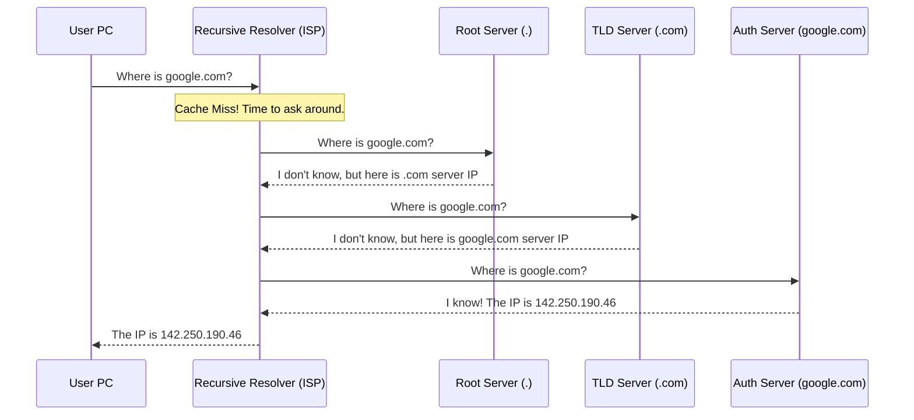

# 1. DNS (Domain Name System)
**DNS** is the phonebook of the internet. It maps human-friendly names to machine-friendly IP addresses.

### How it works
When you ask for a website, your computer checks locations in a specific order (Caching):

1.  **Local Browser Cache**: "Did I visit this site recently?"
2.  **OS System Cache**: "Does my computer know this IP?"
3.  **Recursive Resolver (ISP)**: "I'll ask my Internet Service Provider's DNS."
4.  **Root / TLD / Authoritative Servers**: If the ISP doesn't know, it goes on a hunt across the internet to find the official answer.

> **Analogy**: 
> - **Browser/OS Cache**: Checking your own contact list.
> - **Recursive Resolver**: Asking a helpful librarian.
> - **Authoritative Server**: Calling the person directly to verify.

### Full DNS Lookup Visualization (Recursive Query)
When the Recursive Resolver (ISP) doesn't have the IP in cache, it performs a full lookup:



### Why Caching Matters
**Speed & Efficiency**: Caching prevents the entire world from spamming the central servers for every single request. It makes browsing faster and more efficient.

---

# 1.1 Practical Application
### `nslookup` - Check DNS
Use this command to see what IP address a domain resolves to.
```bash
# Windows/Mac/Linux
nslookup google.com
```
*Output will show the "Address" which is the IP of Google.*

### `dig` - Detailed DNS Query
Use this to get more info about the DNS lookup.
```bash
# Windows/Mac/Linux
dig +trace google.com
```

### `ping` - Check Connectivity
Use this to test if your computer can reach that IP.
```bash
ping google.com
```
*This confirms that your computer can send data to Google and get a reply.*

### `traceroute` - Show Route to Destination
Use this to see how your computer reaches the destination.
```bash
# Windows/Mac/Linux
traceroute google.com
```
*Output will show the hops (routers) your data passes through to reach Google.*


Becareful when using traceroute and showing it, it may expose entry points to your network for attackers to exploit. I am protected by ISP dynamic IP address. 

# 1.2 Security Considerations
DNS is a old technology, as such DNS query are in plaintext, seceptical to an attack named "DNS poisoning". Attackers can intercept (man-in-the-middle) DNS queries and redirect users to malicious websites.

When we query a website for example, example.com, the DNS resolver is suppose to return the IP address of example.com (105.105.105.105), however the attacker can intercept the DNS query and reply user with a fake IP address (106.106.106.106). This is called DNS poisoning.

DNSSEC (DNS Security Extensions) is a set of extensions to DNS that provides authentication of DNS data. It uses public-key cryptography to verify the integrity and authenticity of DNS data.

read more about DNSSEC [here](https://www.cloudflare.com/learning/dns/dnssec/how-dnssec-works/).

